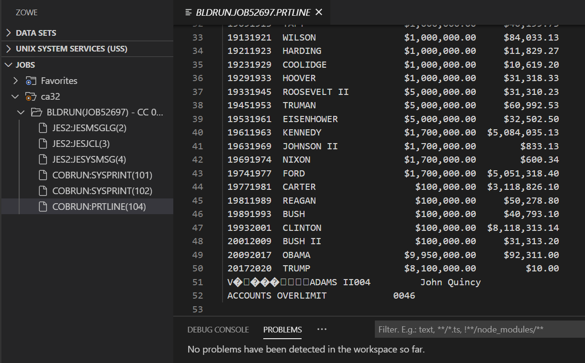
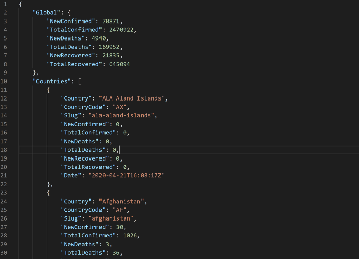

---
geometry:
- margin=1in
header-includes:
- \lstset{basicstyle=\ttfamily,
    stepnumber=2,
    numbersep=5pt,
    backgroundcolor=\color{black!10},
    showspaces=false,
    showstringspaces=false,
    showtabs=false,
    tabsize=2,
    captionpos=b,
    breaklines=true,
    breakatwhitespace=true,
    breakautoindent=true,
    linewidth=\textwidth}
- \hypersetup{colorlinks=true,
              linkcolor=blue}
---
\newpage
# COBOL Challenges

As you have now handled some basic exercises, we have prepared a new section containing more advanced exercises that test your ability to resolve bugs and other issues in COBOL programs. Each exercise will have a short description and a goal to be accomplished.

In case you get stuck, a blog with instructions will be published shortly after each exercise.

Happy Coding!

\newpage

## COBOL Challenge - Debugging

It is 2020 in Washington, D.C. John Doe runs a program which provides financial reports on US Presidents and tallies the number of reports from the state of Virginia. Everything seems OK. (see below)


John is satisfied, as he can see that everything is working as it should be. He calls it a day and goes home.

The next day, when he comes back to the office, his colleague Mari tells him “I’ve made some changes to one of your programs so that it also tallies the number of presidents who spent more than their allowed limit. Check it out.”

He runs his usual reports and sees the following:



Clearly, Mari’s changes to the program that generates the reports have broken something.

Can you fix the code to get the correct result? The new source code is named **CBL0106** and the JCL is **CBL0106J**. In case you get stuck, the solution is in the file **CBL0106C**. 

You can find them in the github repository for the COBOL course, in the subfolder **/COBOL Programming Course #2 - Advanced Topics/Challenges/Debugging**.

# COBOL Challenge - The COVID-19 Reports

Today, you are tasked to create a COVID-19 Summary Report of all the countries around the world, using information from the COVID19API website.

## Instructions

- Extract the response from this API: https://api.covid19api.com/summary. You will receive a JSON file that is similar to the image below:



- Convert that file to CSV format. It should look like this. In my example, I only chose the “Countries” part.


- Using Zowe, upload the CSV file to the mainframe.

**Hint:** You can use the command `zowe files ul ftds “file location” “dataset name”` to upload the CSV file to the mainframe.

- Create a new member in your *.CBL data set to write your COBOL program.

**Hint:** You can create a member using Zowe Explorer or Zowe CLI.

- Write a COBOL program that reads the uploaded CSV file and reformats it to display the contents like this:

```
********************************************************************
DATE: 2020-04-22
TIME: T16:54:5
COUNTRY: "Antigua and Barbuda"
COUNTRY CODE: "AG"
SLUG: "antigua-and-barbuda"
NEW CONFIRMED CASES: 00000
TOTAL CONFIRMED CASES: 00023
NEW DEATHS: 00000
TOTAL DEATHS: 00003
NEW RECOVERIES: 00004
TOTAL RECOVERIES: 00007
********************************************************************
```

- Compile and test your work.

## Advanced Tasks

If you want a more challenging approach, try the optional tasks below:

- Reformat the data into a Report Form like this:


- Automate. Using NPM and Zowe CLI, run all these steps and create a “one click” COBOL build similar to this:


## Solution

To check the solution, refer to the blog post [here](https://medium.com/@jessielaine.punongbayan/solution-covid-19-reports-cobol-challenge-6c509579e3fe?source=friends_link&sk=5a662034a03c91d639b77267ed6abfc9).

Happy Coding! 😉

_Disclaimer: This challenge is also posted in [Medium.com](https://medium.com/@jessielaine.punongbayan/cobol-challenge-covid-19-reports-ee03a946bd23)._
